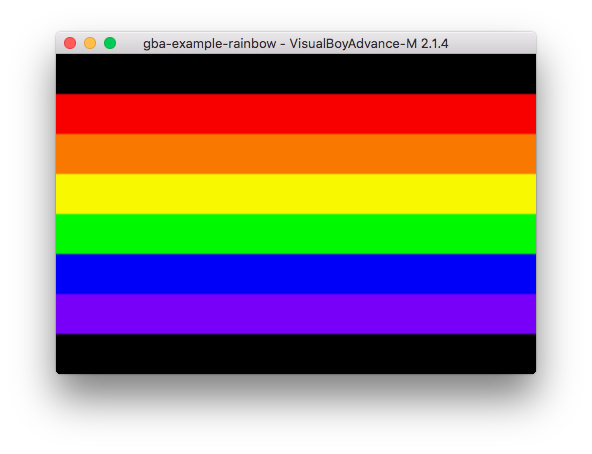

# gba-example-rainbow

An extremely basic test application using the `gba-core` library.

## Dependencies

- The `rust-src` Rust component (`rustup component add rust-src`)
- `cargo-xbuild` and `cargo-binutils` (available via `cargo install`)
- `gbafix` somewhere in your `$PATH` - Either the DevkitPro version, or the
    Rust version shipped with the `gba-core` library.

## Compiling

Run `make`. Once that finishes, the ROM file will be available in the
`target/arm7tdmi/release` directory, as `gba-example-rainbow.gba`.

## Usage

The up and down keys will change the width of the stripes of the rainbow.
